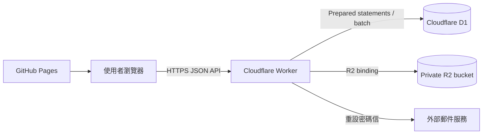

# 問卷系統：從 GAS／Google Drive 遷移至 Cloudflare 的實作指南

> 文件狀態：遷移設計與驗收基準。Worker、資料遷移及測試完成前，不可停用 GAS。

本指南說明如何將目前的 Google Apps Script（GAS）、Google Sheets 與 Google Drive 後端，遷移到 Cloudflare Workers、D1 與 R2；前端暫時維持 GitHub Pages。

遷移不是只更換 API 網址，而是要完整重作目前後端行為，並確保資料不遺失、登入不失效、庫存不超賣、附件仍受權限保護。

---

## 一、不可妥協的遷移原則

1. **識別碼永遠是字串**：帳號、密碼輸入、題目 ID、選項值、電話、生日碼等均以 JavaScript `string`、Python `str` 與 D1 `TEXT` 處理，不得使用 `Number()`、`parseInt()` 或自動型態推斷。
2. **遷移程式不得猜資料**：若來源已遺失前導零，不可依特定帳號硬編碼補零；應輸出異常報告，由管理者依原始資料確認。
3. **寫入必須可重試**：`respondentSave`、`respondentSubmit` 必須保留 `requestId` 冪等機制。
4. **庫存必須原子更新**：不可「先查剩餘量、回 JavaScript 計算、再無條件更新」。
5. **附件預設私有**：回答附件不得使用永久公開 URL，下載前必須驗證權限。
6. **先驗證再切換**：D1、R2、Worker 和前端全部通過測試及資料核對後，才切換正式 API。
7. **保留回滾能力**：新系統穩定運作並完成備份前，不刪除 GAS、Sheets 或 Drive。

---

## 二、目標架構與合理預期



| 功能 | 目前 | 遷移後 |
|---|---|---|
| 前端 | GitHub Pages + React | 維持不變 |
| API | GAS Web App | Worker + Hono |
| 結構化資料 | 多個 Google Sheets | D1 |
| 圖片與簽名 | Google Drive | 私有 R2 |
| Session | GAS HMAC token | Worker HMAC token或 JWT |
| 寄信 | `MailApp.sendEmail()` | Resend、SES 或其他郵件服務 |
| 寫入互斥 | `LockService` | 原子條件更新、唯一鍵、D1 `batch()`；必要時 Durable Object |

Cloudflare 預期可顯著降低 GAS／Sheets 的 RPC 延遲，但不得保證固定 2 ms SQL、50 ms API 或固定加速倍率。D1 寫入位置、使用者地區、查詢數、索引與資料量都會影響實際延遲，應以 staging 的 p50／p95／p99 壓測為準。

免費方案適合開發及中小型使用量，但「R2 免 egress」不代表所有服務完全免費。上線前應依 Cloudflare 當期官方價格確認 Workers 請求與 CPU、D1 rows read／written、D1 儲存及 R2 Class A／B 操作額度，並設定用量告警。

---

## 三、檔案規劃

```text
問卷系統/
├── backend/                         # 舊 GAS；穩定前保留
├── frontend/
│   ├── .env.example
│   └── src/api.js
└── worker/
    ├── package.json
    ├── wrangler.jsonc               # 或 wrangler.toml，擇一
    ├── migrations/
    │   ├── 0001_initial.sql
    │   └── 0002_indexes.sql
    ├── src/
    │   ├── index.js
    │   ├── routes/{admin,respondent,attachments}.js
    │   ├── services/{inventory,mail,storage}.js
    │   └── utils/{auth,idempotency,validation}.js
    ├── tools/
    │   ├── export_google.py
    │   ├── validate_export.py
    │   ├── import_d1.py
    │   ├── migrate_drive_to_r2.py
    │   └── reconcile.py
    └── test/
        ├── api-contract.test.js
        ├── concurrency.test.js
        └── migration.test.js
```

`.gitignore` 至少加入：

```gitignore
service_account.json
raw_export*.json
migration_import*.sql
migration-report*.json
.dev.vars
.env
.env.*
!.env.example
```

Google service account、R2 key、郵件服務 key、session secret 與匯出資料不得提交到 Git。

---

## 四、現有 API 相容清單

Worker 上線前，下列現有 action 必須逐一實作並通過 API contract test。不能只依 `action.startsWith('admin')` 分流，因為註冊、重設密碼與附件下載等 action 不符合此前綴。

### 公開與帳號

- `ping`、`register`、`forgotPassword`、`resetPassword`
- `adminLogin`、`adminLogout`、`adminProfile`、`adminUpdateProfile`

### 管理端

- `adminProjects`、`adminCreateProject`、`adminUpdateProject`
- `adminCloneProject`、`adminArchiveProject`、`adminDeleteProject`、`adminProject`
- `adminSaveSchema`、`adminSaveUserFields`、`adminImportUsers`、`adminSaveLinkedOptions`
- `adminUsers`、`adminResponses`、`adminUpdateResponse`
- `adminStats`、`adminAdvancedAnalytics`、`adminLogs`
- `adminInventory`、`adminAdjustInventory`
- `adminAttachments`、`adminDeleteAttachment`、`adminDownloadAllAttachments`
- `adminUpload`、`adminQuestionImageUpload`、`adminExport`
- `adminSetFrontendUrl`、`adminMigrateSystem`

### 填寫端與附件

- `respondentProject`、`respondentLogin`、`respondentGuestLogin`、`respondentLogout`
- `respondentSurvey`、`respondentSave`、`respondentSubmit`
- `respondentUpload`、`respondentDeleteAttachment`、`attachmentDownload`

回應格式維持：

```json
{ "ok": true, "data": {}, "message": "..." }
```

或：

```json
{ "ok": false, "error": { "code": "...", "message": "...", "details": null } }
```

---

## 五、D1 schema 設計要求

正式 schema 放在 `worker/migrations/` 並由 Wrangler migrations 管理，不長期依賴手動執行單一 `schema.sql`。

### 必要資料表

| D1 表 | 來源 |
|---|---|
| `admins` | 管理員設定 |
| `password_resets` | 密碼重設紀錄 |
| `system_settings` | 系統設定 |
| `projects` | 專案索引 + 專案設定 |
| `questions` | 問項設計 |
| `question_options` | 一般選項設定 |
| `user_field_definitions` | 使用者欄位設定 |
| `survey_users` | 問卷使用者設定 |
| `linked_options` | 連結型選項設定 |
| `linked_matrix_prompts` | 連結型矩陣問項設定 |
| `survey_answers` | 使用者回答 |
| `survey_statuses` | 填寫狀態 |
| `inventories` | 庫存設定 |
| `inventory_transactions` | 庫存異動紀錄 |
| `attachments` | 附件紀錄 |
| `audit_logs` | 系統操作紀錄 + 專案操作紀錄 |
| `idempotency_requests` | 請求去重紀錄 |

### 關鍵限制

```sql
PRAGMA foreign_keys = ON;

-- 帳號在每個專案內唯一，且保持 TEXT。
PRIMARY KEY (project_id, account)

-- 每位填寫者每題只有一筆目前答案。
UNIQUE (project_id, account, question_id)

-- 一般選項不可重複。
UNIQUE (project_id, question_id, option_value)

-- 個人化選項不可重複。
UNIQUE (project_id, question_id, account, option_value)

-- 同一冪等請求只執行一次。
PRIMARY KEY (request_id, account, action)

-- 庫存永遠不可為負。
CHECK (initial_stock >= 0)
CHECK (remaining_stock >= 0)

-- 布林欄位只接受 0 或 1。
CHECK (active IN (0, 1))
```

必要外鍵：

- questions、options、prompts、inventory → projects／questions。
- statuses、answers、attachments、inventory transactions → `(project_id, account)`。
- password resets → admins。
- 刪除專案時才對專案子資料使用 `ON DELETE CASCADE`；管理員刪除政策另行明確定義。

必要索引：

- `projects(admin_id, project_status)`
- `questions(project_id, active, section_id, question_order)`
- `question_options(question_id, active, option_order)`
- `linked_options(project_id, account, question_id, active)`
- `survey_answers(project_id, account)`
- `attachments(project_id, account, active)`
- `audit_logs(project_id, created_at)`
- `inventory_transactions(project_id, question_id, option_value, created_at)`

不要使用 `INSERT OR REPLACE` 做 upsert；SQLite 的 `REPLACE` 可能先刪除舊列再插入，進而觸發 cascade。應使用 `INSERT ... ON CONFLICT (...) DO UPDATE SET ...`。

匯入後必須執行：

```sql
PRAGMA foreign_key_check;
```

結果不為空即視為遷移失敗。

---

## 六、文字、數值、日期、布林與 JSON

Google Sheets API 的 `FORMATTED_VALUE` 取得的是畫面顯示值，不是原始輸入值。它能保留目前已顯示的前導零，但日期、百分比、千分位及科學記號也可能被改寫。

匯出工具必須依欄位分類：

| 類型 | 範例 | 規則 |
|---|---|---|
| 識別字串 | account、ID、option_value、電話 | 讀取顯示字串，禁止轉數字 |
| 數量 | stock、order、file_size、revision_count | 驗證為整數才轉型；錯誤即停止 |
| 布林 | active、required、show_progress | 明確接受 `true/false/1/0`，其他值報錯 |
| 日期時間 | created_at、submitted_at | 正規化為 ISO 8601；不可解析則報錯 |
| JSON | config_json、answer_value、profile_json | parse 驗證後重新序列化 |

不得以 `str(value).strip()` 套用所有欄位，也不得把解析失敗的整數或布林悄悄改成預設值。

`validate_export.py` 至少檢查：

- 空白、重複 primary key。
- 不符合預期長度的純數字帳號。
- 同專案重複帳號。
- 無對應題目或使用者的回答、狀態、附件、選項及庫存。
- 無效 JSON、日期、布林及整數。
- Drive 找不到的附件。

任何 critical error 都阻止匯入。若來源已遺失前導零，輸出異常報告交人工確認，不可只針對 `kgi` 自動補零。

---

## 七、密碼、Session 與寄信

### 管理員密碼

目前管理員密碼是明文。匯出後應立即轉成帶隨機 salt 的慢速密碼雜湊；原始密碼不得寫入 D1、報告或 log。Workers 可用 Web Crypto 實作 PBKDF2-HMAC-SHA256，雜湊格式必須包含版本、迭代數、salt 與 digest。

不得以字串長度判斷是否已雜湊。PBKDF2 迭代數需依 staging CPU 測試選定，因 Workers Free 的 CPU 額度可能影響登入請求。

### 填寫者密碼

現有填寫者使用 SHA-256。第一階段可保留相容，並用 `password_algorithm` 或版本前綴標示舊格式；日後可在登入成功時逐步升級。管理員與填寫者的驗證流程必須分開。

### Session

- `SESSION_SECRET` 使用 `wrangler secret put`，不可放在 `[vars]` 或 Git。
- HMAC 比對使用 constant-time comparison。
- Token 包含 `kind`、identity、expiry 與 nonce。
- 管理員與填寫者 token 不可混用。
- 若要求登出後立即失效，須增加 session／revocation 儲存；單純無狀態 JWT 無法立即撤銷。
- 登入 rate limit 不能只存在 Worker 記憶體；應用 Cloudflare Rate Limiting、Durable Object 或其他集中式方案。

### 密碼重設信

Worker 沒有 GAS `MailApp`。上線前必須選定郵件服務、完成寄件網域驗證，並以 Worker secret 保存 API key。重設 token 只保存 hash，15 分鐘過期且只能使用一次。

---

## 八、庫存、revision 與冪等

### 原子庫存更新

扣減庫存使用帶條件的 SQL：

```sql
UPDATE inventories
SET remaining_stock = remaining_stock - ?, updated_at = ?
WHERE project_id = ?
  AND question_id = ?
  AND option_value = ?
  AND active = 1
  AND remaining_stock >= ?;
```

異動筆數不是一列即視為庫存不足。修改已送出回答時，先計算舊答案與新答案差額，再把所有條件更新、回答 upsert、狀態 revision、庫存異動紀錄與冪等結果放入同一 D1 `batch()`。

D1 Workers API 不能包住任意 JavaScript 邏輯形成傳統長交易；不可在數次獨立 round trip 之間假設鎖仍存在。若複雜差額流程不能以條件 SQL 與單次 batch 安全完成，應把每個專案的寫入序列化到 Durable Object，再由其操作 D1。

### revision

更新回答時驗證前端 revision；只有目前 revision 相符才更新，否則回傳 `CONFLICT`，避免多裝置以舊資料覆蓋新資料。

### requestId

前端 save／submit 以同一 `requestId` 重試。Worker 若找到相同 `(request_id, account, action)`，回傳首次成功結果；相同 request ID 搭配不同帳號或 action 時拒絕。冪等紀錄可定期清理，但保留時間須長於最大重試窗口。

---

## 九、R2 附件設計

Bucket 維持 private。R2 key 不使用使用者提供的原始檔名：

```text
survey-attachments/
└── {project_id}/
    ├── respondent/{attachment_id}
    ├── question/{attachment_id}
    └── export/{export_id}
```

原始檔名存在 `attachments.file_name`，R2 key 使用 UUID `attachment_id`，避免碰撞、特殊字元與路徑穿越。

### 上傳

目前上限為 5 MB，可先由 Worker 接收並串流到 R2 binding：

1. 驗證 token、project、account、question 與題型。
2. 允許 JPEG、PNG、WebP；填答附件另相容 HEIC／HEIF；簽名只接受 PNG。
3. 驗證 Content-Type、檔案大小與魔術碼，不信任副檔名。
4. R2 put 成功後才寫附件紀錄；D1 失敗時刪除孤兒 object，或交由清理工作回收。

若改用 presigned PUT，仍須有完成確認、實際大小與內容驗證，不能因瀏覽器直接上傳便省略安全檢查。

### 下載與刪除

- 回答附件經 `attachmentDownload` 驗證權限後，由 Worker 串流或核發短效 presigned GET URL。
- 題目公開圖片可走獨立公開路徑，但不能與回答附件共用公開規則。
- presigned URL 是 bearer URL，有效期應盡量短。
- 刪除採 D1 `active=0` 加 R2 delete；失敗須可重試並留下 audit log。

### Drive 搬移

現有 `attachment_type` 是 `signature` 或 `image`，搬移工具須明確映射到新類別。每個檔案成功上傳後，都要把 `r2_key` 寫入 D1，並核對 Drive file ID、位元組大小、SHA-256 checksum、MIME 與 D1 row。R2 credentials 從環境變數讀取，不可硬編碼在 Python。

---

## 十、Worker、CORS 與前端

### Wrangler 範例

```jsonc
{
  "$schema": "node_modules/wrangler/config-schema.json",
  "name": "survey-api",
  "main": "src/index.js",
  "compatibility_date": "2026-08-26",
  "d1_databases": [{
    "binding": "DB",
    "database_name": "survey-db",
    "database_id": "<D1_DATABASE_ID>"
  }],
  "r2_buckets": [{
    "binding": "STORAGE",
    "bucket_name": "survey-attachments"
  }],
  "vars": {
    "FRONTEND_ORIGIN": "https://<username>.github.io"
  }
}
```

```bash
npx wrangler secret put SESSION_SECRET
npx wrangler secret put MAIL_API_KEY
```

Production CORS 只允許實際 GitHub Pages origin 或自訂網域；localhost 只放在開發環境。正確處理 OPTIONS，允許必要的 `Content-Type`、`Authorization`，不要用 `*` 搭配 credential。

前端沿用現有 `ApiError` 格式、`requestId`、AbortController 與安全重試，只把環境變數由 `VITE_GAS_API_URL` 改成 `VITE_API_URL`：

```properties
VITE_API_URL=https://survey-api.<account>.workers.dev
```

重試原則：

- 唯讀 action 可對 408、429、502、503、504 做有限次 exponential backoff。
- save／submit 只有在 requestId 冪等完成後才能重試。
- validation、unauthorized、forbidden、conflict 不自動重試。
- 單次 timeout 與總重試時間依實測調整，不再固定 10 次 × 45 秒。

---

## 十一、完整資料映射與匯入要求

所有表都必須匯出、驗證及匯入；若決定排除過期密碼重設或過期去重紀錄，須在 migration report 記錄數量與規則。

| Google 來源 | D1 目標 | 注意事項 |
|---|---|---|
| 管理員設定 | admins | 密碼立即轉安全雜湊；保留 email_verified |
| 密碼重設紀錄 | password_resets | token hash 不可外洩 |
| 系統設定 | system_settings | 不得漏掉系統名稱等設定 |
| 專案索引 + 專案設定 | projects | Drive／Sheet ID 留在遷移報告 |
| 系統操作紀錄 | audit_logs | 保留 admin_id、project_id |
| 使用者欄位設定 | user_field_definitions | 補 project_id |
| 問卷使用者設定 | survey_users | account 保持 TEXT |
| 問項設計 | questions | 驗證 JSON |
| 一般選項設定 | question_options | option_value 保持 TEXT |
| 連結型選項設定 | linked_options | 驗證帳號與題目 |
| 連結型矩陣問項設定 | linked_matrix_prompts | 不可漏匯 |
| 使用者回答 | survey_answers | 驗證答案 JSON 與題目 |
| 填寫狀態 | survey_statuses | revision_count 為整數 |
| 庫存設定 | inventories | 庫存不得為負 |
| 庫存異動紀錄 | inventory_transactions | 與目前庫存核對 |
| 附件紀錄 | attachments | Drive ID 轉成 r2_key |
| 專案操作紀錄 | audit_logs | 加入 project_id |
| 請求去重紀錄 | idempotency_requests | 可只搬仍在有效窗口的資料 |

SQL 一律使用 prepared statement／bind，不用 Python f-string 拼接正式資料 SQL。大量匯入分批處理，記錄成功批次與失敗位置，以便安全續跑。

---

## 十二、部署與正式切換

所有 Worker 指令統一從 `worker/` 執行：

```bash
cd worker
npm ci
npx wrangler login
npx wrangler d1 create survey-db
npx wrangler r2 bucket create survey-attachments
```

填入 `database_id` 後：

```bash
npx wrangler d1 migrations apply survey-db --local
npm test
npx wrangler d1 migrations apply survey-db --remote
npx wrangler deploy
```

正式切換流程：

1. 建立 staging D1、R2 與 Worker。
2. 對 staging 執行完整匯出、驗證、匯入及附件搬移。
3. 執行 API contract、權限、附件、庫存並行與端到端測試。
4. 修正全部 migration critical error。
5. 宣告維護窗口，暫停 GAS 寫入或切成唯讀。
6. 備份 Master Sheet、所有專案 Sheet 與 Drive 附件清單。
7. 執行最終全量或增量匯入。
8. 執行 reconciliation，確認所有表與附件。
9. 更新 GitHub Actions 的 `VITE_API_URL` 並部署前端。
10. 執行 production smoke test。
11. 監控錯誤率、延遲、D1 用量、R2 操作及 Worker CPU。
12. 穩定觀察期內保留 GAS／Sheets／Drive，不刪除舊資料。

不要直接以 `git add .` 當部署步驟；先用 `git status` 確認沒有 service account、匯出 JSON、SQL 或 secret 被加入。

---

## 十三、驗收清單

### 資料

- 每一來源表與 D1 目標表筆數相符，或差異有明確排除清單。
- 每個專案的使用者、題目、選項、回答、狀態、庫存與附件筆數相符。
- 純數字帳號依來源顯示字串逐筆相符，包含前導零與長度。
- JSON 欄位可完整 parse，重新序列化後語意相同。
- `PRAGMA foreign_key_check` 結果為空。
- 無重複 `(project_id, account, question_id)` 回答。
- `remaining_stock >= 0`，庫存異動加總與目前庫存一致。
- 每個有效附件都有可讀 R2 object，size 與 checksum 相符。
- 每個 R2 respondent object 都有對應 D1 row，無孤兒物件。

### 功能與安全

- 管理員登入、登出、註冊、個人資料與密碼重設正常。
- 指定使用者登入、錯誤密碼 rate limit、公開訪客接續正常。
- 所有題型可載入、暫存、送出、重載及由管理員代改。
- revision conflict 能阻止舊資料覆蓋。
- 重複 requestId 不重複扣庫存或建立回答。
- 並行送出不會讓庫存小於零。
- 管理員只能讀取自己的專案。
- 填寫者不能讀取其他帳號的選項或附件。
- 上傳拒絕錯誤 MIME、錯誤魔術碼、超過 5 MB 與題型不符的檔案。
- CSV、統計、進階分析與附件打包結果相容。

### 效能與額度

記錄 staging p50／p95／p99，至少測試：

- 專案首頁與問卷載入。
- 500／1,000 使用者規模的管理列表與統計。
- 暫存、正式送出及含庫存題目的並行送出。
- 5 MB 附件上傳與下載。
- 主要查詢的 D1 `rows_read`／`rows_written` 與 query plan。

---

## 十四、回滾、備份與監控

若出現登入普遍失敗、資料核對不符、庫存負數、附件大量不可讀或 Worker／D1 額度阻斷，立即停止 Worker 新寫入，將前端 API 指回 GAS，並保留問題期間 D1 資料供人工合併。

一旦新舊系統都接受過寫入，回滾不能只改 URL；必須先處理兩邊新增資料。因此正式切換期間應避免雙邊同時可寫，或事先實作明確的雙寫與 reconciliation 策略。

備份與營運要求：

- 切換前保存 Google Sheets 與 Drive 清單快照。
- 啟用並演練 D1 Time Travel／restore。
- 定期保存 D1 export 與 R2 inventory 到獨立位置。
- 監控 Worker 5xx、429、CPU limit、延遲及 D1／R2 用量。
- 記錄登入失敗、庫存不足、revision conflict 與附件失敗。
- log 禁止出現密碼、完整 token、重設 token 或附件內容。

---

## 十五、完成定義

只有以下項目全部完成，才可把遷移標記為完成：

- Worker 已完整實作所有現有 action，而不是只有路由骨架。
- 所有 Google 表都有資料映射、匯入結果與差異報告。
- 所有附件已搬移、寫回 `r2_key` 並通過 size／checksum 核對。
- 管理員密碼已安全雜湊，密碼重設信可正常寄送。
- requestId、revision 與原子庫存通過並行測試。
- 權限、CORS、rate limit、secret 與私人附件下載通過安全測試。
- staging 與 production migration 可重複執行且不破壞資料。
- 正式切換、回滾、備份與監控流程已演練。
- GAS 與舊資料在穩定觀察期結束前保持可回復狀態。

在上述條件完成前，`backend/*.gs`、`.clasp.json`、Google Sheets 與 Drive 只能標記為 legacy／read-only，不應刪除。
